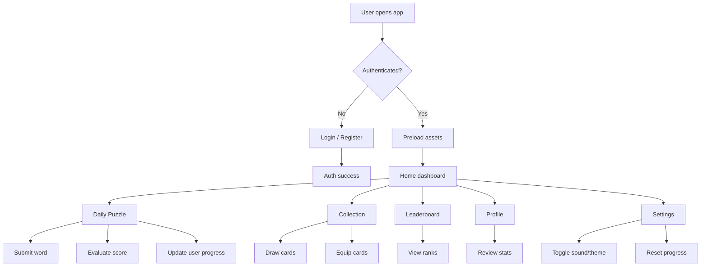
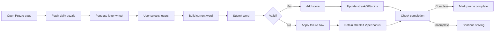
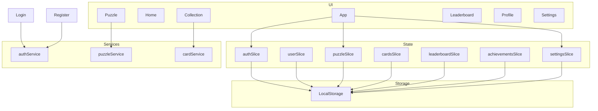

# Product Requirements Document (PRD)

## Project Overview

**Name:** Kung Fu Word Quest

**Type:** React + TypeScript single-page app built with Vite

**Scope:** A gamified word puzzle experience where authenticated users complete daily letter-wheel puzzles, collect character cards, earn XP, unlock achievements, and compete on a leaderboard.

**Platform:** Frontend-only application using localStorage-backed mock services; no external backend is implemented.

---

## Objectives

- Deliver a polished daily puzzle experience with a martial-arts-themed interface.
- Provide persistent progression through belts, XP, coins, cards, and achievements.
- Enable player engagement via collection mechanics, card bonuses, and leaderboards.
- Maintain a lightweight React + Vite architecture with clear state management.

---

## Audience

- Casual mobile/desktop players who enjoy word puzzle games.
- Players seeking daily challenge and progression mechanics.
- Users who appreciate character collection and reward systems.

---

## Product Summary

The app is organized around a protected authenticated experience.
Users log in or register, then access a dashboard and the following main flows:

- Daily Puzzle (`/puzzle`)
- Collection and card draw system (`/collection`)
- Leaderboard view (`/leaderboard`)
- Profile and progress tracking (`/profile`)
- Settings for sound, theme, and reset progress (`/settings`)

Public auth routes are `/login` and `/register`.

---

## Core Features

1. **Authentication
**
   - Mock login and registration via `frontend/src/services/authService.ts`
   - Local storage persistence for user credentials and auth state
   - `ProtectedRoute` protects authenticated pages
   - `PublicRoute` redirects logged-in users away from auth pages

2. **Daily Puzzle Gameplay**
   - Letter wheel UI rendered in canvas via `LetterWheel.tsx`
   - Validation of words against a daily puzzle word list and center letter constraint
   - Score calculation with bonuses, streak handling, and penalties
   - Hint/reveal mechanics with coin cost and card-based free hint bonuses
   - Puzzle state persisted in Redux slice `puzzleSlice.ts`

3. **Card Collection and Equip System**
   - Character cards defined in `constants/index.ts`
   - Unlock, equip, and filter logic managed by `cardsSlice.ts`
   - Draw chest mechanic with duplicate refunds via `cardService.ts`

4. **Player Progression**
   - XP and belt progression through `userSlice.ts`
   - Coins, streak, rank, and achievement tracking
   - Achievement evaluation in `achievementsSlice.ts`

5. **Leaderboard**
   - Mock leaderboard entries plus current user ranking managed in `leaderboardSlice.ts`
   - Rank table and podium display

6. **Profile and Settings**
   - Profile page summarizes stats, belt progress, achievements, and equipped card
   - Sound + dark mode toggles persist via `settingsSlice.ts`
   - Reset progress clears user, cards, achievements, leaderboard, puzzle state, and settings

---

## Value Propositions

- Daily engagement via changing puzzles and card bonuses
- Collectible mechanics encourage return play
- Immediate feedback through scoring and achievement unlocks
- Clear visual theme with dojo-inspired UI and immersive backgrounds

---

## Requirements

### Functional

- Users can authenticate and stay signed in across sessions
- Authenticated users can navigate the dashboard and content pages
- Daily puzzles load from a fixed set of mock daily puzzles
- Word submissions require the center letter and minimum length
- Cards grant gameplay bonuses and can be unlocked/equipped
- Achievements update based on user progress
- Settings persist theme and sound preferences
- Local storage keeps progression between browser sessions

### Nonfunctional

- App must run in modern browsers via Vite build
- UI must adapt to desktop and mobile through responsive layout
- State should stay centralized in Redux for consistency
- Preloading assets improves first render performance

---

## Architecture Overview

### Tech Stack

- React 19
- TypeScript 6
- Vite
- Redux Toolkit
- React Router DOM 7
- Tailwind CSS
- Lucide icons

### Key Modules

- `src/App.tsx`: route definitions and asset preload logic
- `src/store/`: Redux slices and hooks
- `src/services/`: mock service API layer
- `src/constants/`: game data definitions
- `src/types/`: shared type definitions
- `src/components/`: reusable UI and layout components
- `src/pages/`: route-specific screens

---

## User Flow

### Daily Puzzle Flow

### Data Layer Diagram

---

## Feature Breakdown

### Authentication

- `authService.login` and `authService.register`
- Local storage key: `kungfu_auth`
- Login auto-registers if no user exists
- Redirects handled in `AuthRoute.tsx`

### Puzzle Gameplay

- `DailyPuzzle` model has letters, center letter, valid words, difficulty, xp reward, and coin reward
- `Puzzle` page loads puzzle from `puzzleService.getDailyPuzzle`
- `LetterWheel` canvas handles letter taps and selection
- Scoring includes base points, card modifiers, streak multipliers, invalid-word handling, and completion
- Hints use `deductCoins` or card-based free hints

### Card System

- Character cards are seeded from `CHARACTER_CARDS`
- Unlock and equip flows stored in `cardsSlice`
- `Collection` page supports filtering by rarity and drawing cards
- Duplicate draws refund coins by rarity

### Achievements

- Default achievement definitions in `DEFAULT_ACHIEVEMENTS`
- Evaluation performed by `achievementsSlice.evaluateAchievements`
- Achievements persist to `kungfu_achievements`

### Profile & Progress

- `Profile` page aggregates user stats, belt progress, and achievements
- Belt progression logic in `userSlice.evaluateBelt`
- User stats are stored in `kungfu_user`

### Leaderboard

- Mock entries plus current user insertion via `leaderboardSlice.updateUserScore`
- Persisted to `kungfu_leaderboard`
- Display includes podium layout and rank table

### Settings

- Theme and sound saved to `kungfu_settings`
- Dark mode toggles `document.documentElement.classList`
- Reset progress clears all stored slices and resets defaults

---

## Notable Implementation Notes

- The current app is frontend-only; all data flows are client-side and stored in `localStorage`
- `Puzzle.tsx` validates submitted words with an embedded daily word list, not via `puzzleService.submitWord`
- There are duplicated/hinted word lists in puzzle logic and constants that should be unified for maintainability
- `authService` is a mock layer, not connected to real authentication APIs
- Preloading is implemented in `App.tsx` using `assetPreloader.preloadAll`

---

## Risks & Open Questions

- **Persistence assumptions:** Local storage is used for progression; clearing browser data resets the experience.
- **Data consistency:** Daily puzzle validation and hint arrays should be consolidated to avoid mismatches.
- **Scalability:** No backend or real multiplayer/leaderboard server is present.
- **Security:** Authentication is mock-only and should never be used for production.

---

## Suggested Next Improvements

- Add a backend API for authentication, puzzle data, cards, and leaderboard persistence
- Replace local mock services with real networked endpoints
- Add user profile editing and secure session handling
- Implement game analytics for daily puzzle completion and retention
- Add unit and integration tests for slices, services, and page flows
- Improve accessibility on canvas controls and interactive elements

---

## How to Run

From `frontend/`:

- `npm install`
- `npm run dev`
- `npm run build`

---

## Directory Summary

- `frontend/src/pages/`: route pages
- `frontend/src/components/`: UI, layout, auth, puzzle, cards
- `frontend/src/store/`: Redux slices and typed hooks
- `frontend/src/services/`: mock service layer
- `frontend/src/constants/`: game definitions and mock data
- `frontend/src/types/`: domain typings
- `frontend/src/utils/`: audio and asset preloader

---

## Stakeholders & Goals

- Product: daily retention, engagement through collectibles, varied scoring mechanics
- Engineering: maintain a modular Redux structure, keep UI themes consistent, minimize runtime complexity
- UX: simple onboarding with a clear home dashboard and responsive navigation

---

## Deliverables

- Product documentation for current implementation
- Workflow diagrams for auth, game, and data flows

---

